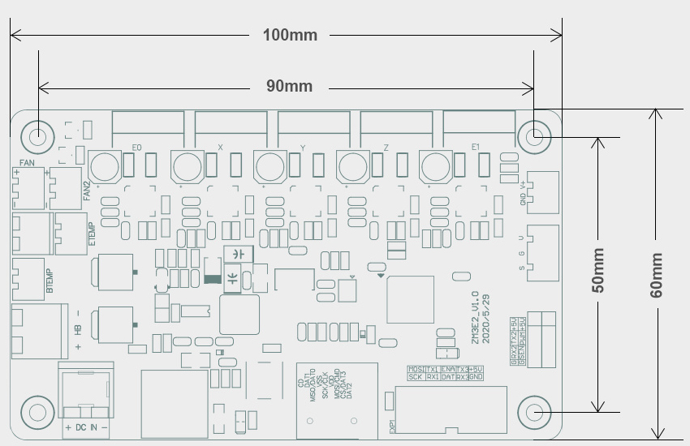
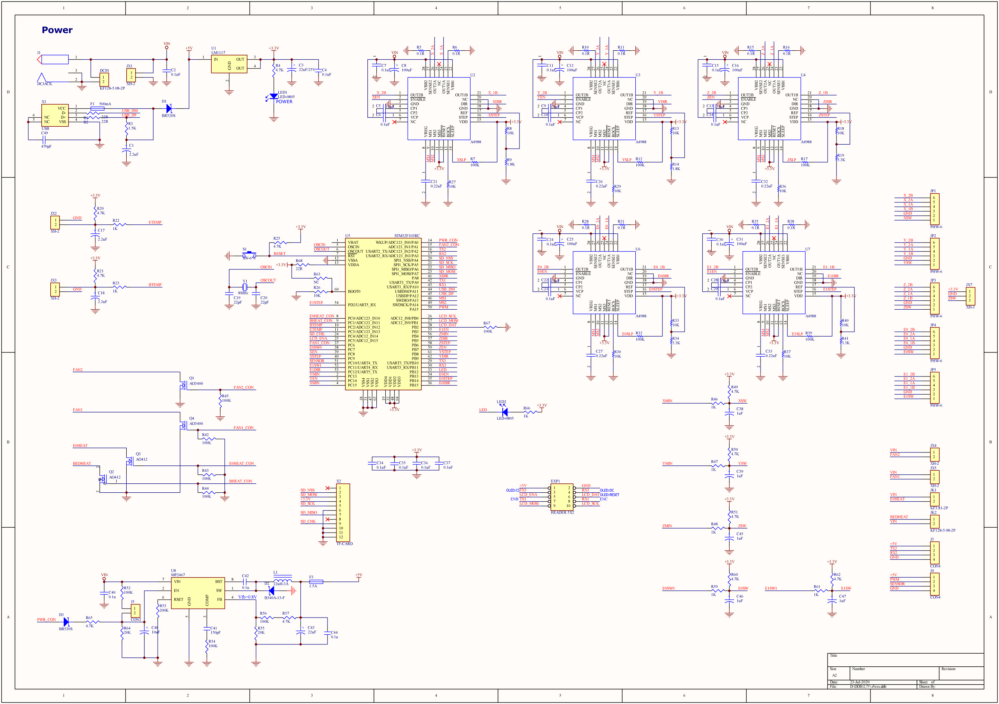
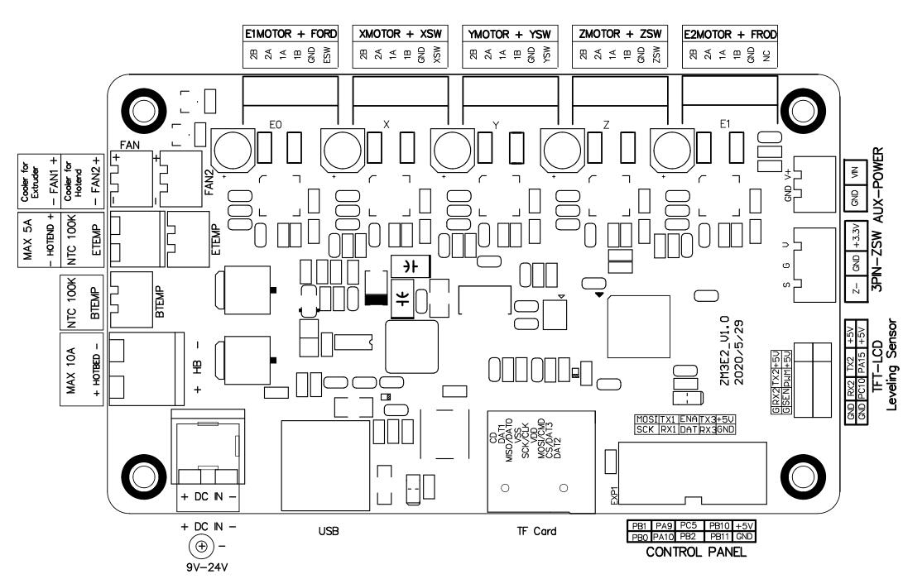
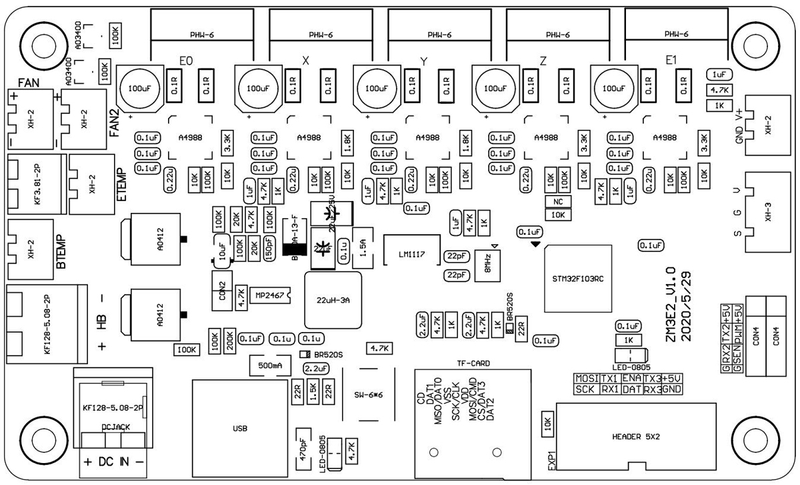
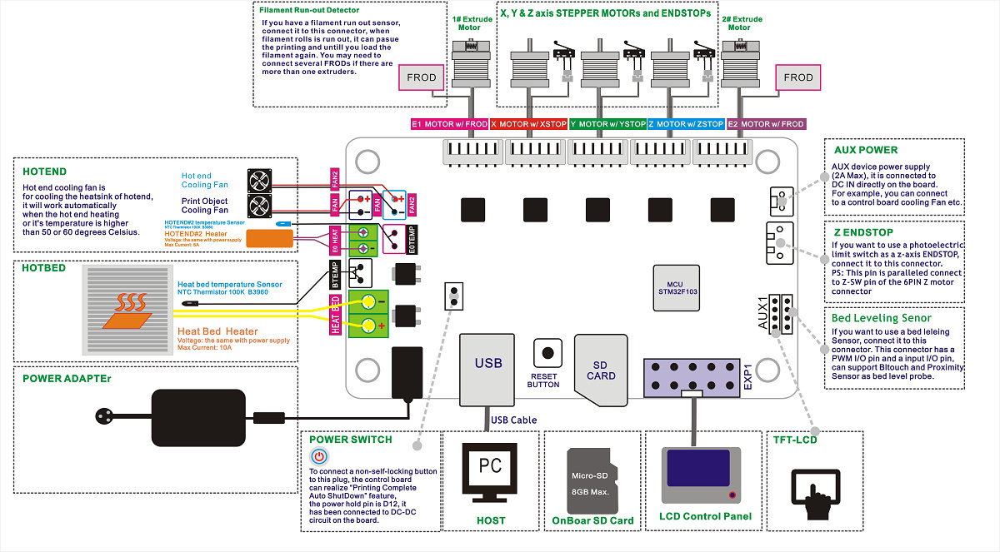
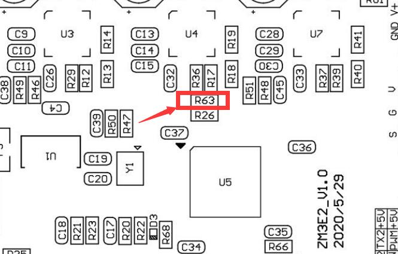
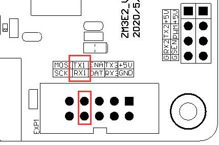

# ZM3E2  
## Board Size  
  

## Schematic diagram [:arrow_down: PDF](./SCH_ZM3E2V1.pdf)  

## Pin out [:arrow_down: PDF](./PINOUT_ZM3E2V1.pdf)
  

## PCB
### Designator   [:arrow_down: PDF](./designtor.pdf)
  
### Parts [:blue_book:PDF](./parts.pdf)
  

## Pin define  
please refer to the file: [***pins_ZM3E2_V1_0.h***](https://github.com/ZONESTAR3D/Control-Board/blob/main/32bit/ZM3E2/pins_ZM3E2_V1_0.h)  
## Wiring reference
  

## Bootloader
### How to programming bootloader of the ZM3E2 control board
### [:arrow_down: Download ZM3E2 bootloader file](./ZM3E2_Bootloader.zip)
The steps for programming the bootloader are as follows:    
1. Short R63 (BOOT0 Pin of the MCU) with tweezers and then power on the control board.
2. Release the tweezers for shorting R63.
3. Programming the bootloader.     

For tools and detailed instructions, please refer to [:book: **the instructions for programming bootloader for ZM3E4**](https://github.com/ZONESTAR3D/Control-Board/blob/main/32bit/ZM3E4/flashBootloader/readme.md).

#### The position of R63 on the control board

#### UART1 pins on the control board
