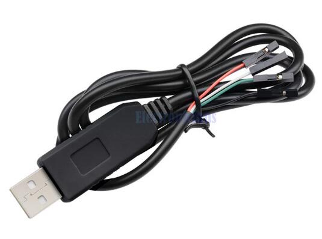
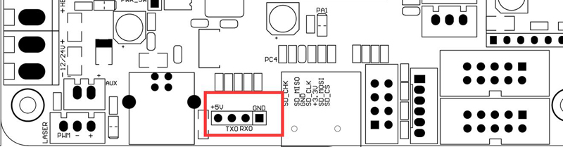
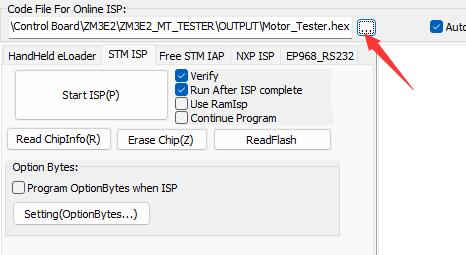
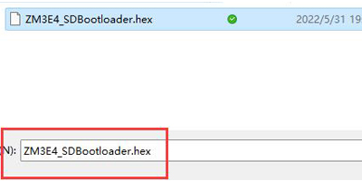
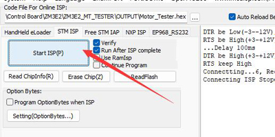
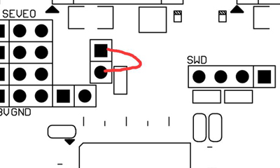
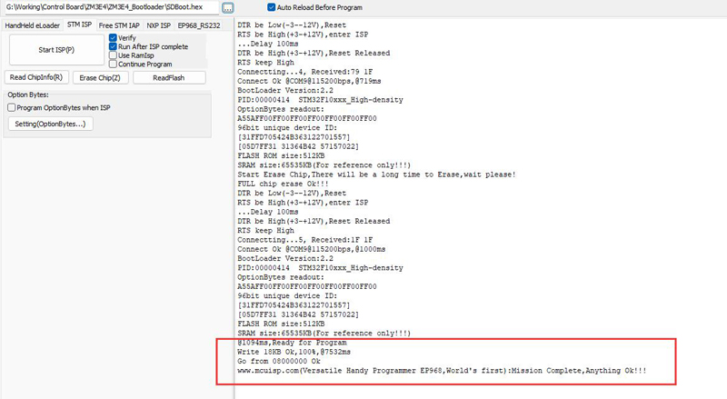

## Flash the bootload to the ZM3E4 control board
### Tools
You need a simply UART tool, for example a "USB to TTL Serial" converter, it looks like the picture below[:point_right: sell link](https://www.aliexpress.com/item/32958291795.html):
 

### Wiring

>
    +5V         <--> If you UART need support power, connect it to your UART tool, otherwire let it float.   
    TX0(PA9)    <--> connect to "TXD" of the UART tool  
    RX0(PA10)   <--> connect to "RXD" of the UART tool   
    GND         <--> connect to "GND" of the UART tool   

### Bootload upload steps
#### :one: Download bootload bin file and tool
Download the [:arrow_down:**bootload bin file**](./ZM3E4_SDBootloader.zip) to your PC and unzip it.
Download the [:arrow_down:**flymcu**](./flymcu.zip) tools to your PC and unzip it.
#### :two: Run flymcu, and choose the com port of your UART tool

#### :three: Load bootload bin file

#### :four: Click the start ISP button on "flymcu" tool

#### :five: Short the "boot0" pin on the control board and power on the control board, and then disconnect it.
:star2: You can use a metal tweezers to short the two points shown in the following picture.    

#### :six: Wait until downloading finished.
Usually it take about 5 ~ 6 seconds, you can see the log information in the right window of flymcu.   

### After uploaded bootloader, you can upload the firmware to the control board by SD card.