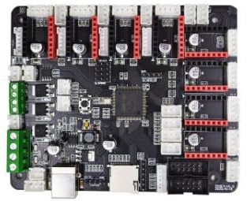
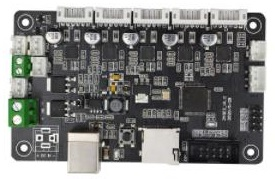

## ZM3E4 3d printer control board
**ZM3E4** is ZONESTAR's latest 32bits 3D printer control board. It is a feature rich electronics solution for Reprap and other CNC devices.  It built in a **STM32F103VET6(or compatible)** MCU on board, which has 256K Flash ROM and 48K RAM, working frequency is as high as 72MHz. ZM3E4 used 4 layers of circuit boards, which has better heat dissipation effect and anti electromagnetic interference capability and reliability. ZM3E4 has 8 motor driver module sokect, it can support up to 5 extruders.  Default it supplied with a test frimware and you can upload own firmware from SD card.
### Features:
- Build-in STM32F103VET6(**or compatible**) 32-bits MCU, 72MHz working frequency.
- 4-layer circuit board.
- Support 8 stepper motor drivers. 
- Support 2 Independent z-axis drivers with ENDSTOPs.
- Support WiFi and TFT-LCD control Panel.
- Bed Levling Sensor interface for Proximity Sensor and BL-Touch
- Support "Printing Finish Power Down" Feature (Need to connect an extral Power UP button).
- Build-in Laser control connnetor.
- 3x FUSEs for HOT BED and DC IN.
- 8x FUSEs for motor driver module.
- 4x External servo interface, with hardware PWM capability (one of them is multiplexed with FAN1).
- 3x temperature ADC connectors for thermistors.
- 2x Fan control connectors.
- 5x PWM capable power mosfet outputs with voltage selector for MainPower.(Bed, Extruder0,  Extruder1, Fans).
- 6x endstop connectors with filter capacitor and the pull-up resistor on the board.
- For X, Y, Z, Z2 motor connector, it also provides five 6 PIN(PH2.0-6PIN) connectors which combined motors wires and limit switchs wires, to make wiring easier.
### Photo:

-----

## ZM3E2 3d printer control board
**ZM3E2** is ZONESTAR's latest 32bits 3D printer control board. It is a feature rich all-in-one electronics solution for Reprap and other CNC devices.  It built in a **STM32F103RCT6** MCU on board, which has 256K Flash ROM and 48K RAM, working frequency is as high as 72MHz. It build in 5 motor drivers on the board, which can support max to 128 micro steps, it makes the motor work with lower noise. It has rich interface, support to connect with 128x64 dots LCD screen or OLED screen, 3Dtouch(BLtouch), **TFT-LCD** controller, and Filament run out detection.  
### Features:
- Build-in STM32F103RCT6(**or compatible**) 32-bits MCU, 72MHz working frequency.
- Build-in 5 motor driver chips on the board.
- 6 PIN(PH2.0-6PIN) connectors which combined motors wires and limit switchs wires, make wiring easier.
- Adjuable micro steps on firmware.
- Provide an EXP connector to connect LCD screen.
- Provide 2x AUX connector to connect Bed leveling sensor or WiFi module.    
### Photo:

-----
## [Source code (for Reference only)](https://github.com/ZONESTAR3D/source-code-for-3d-printer)

