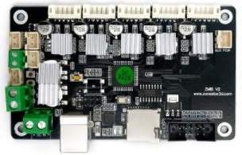
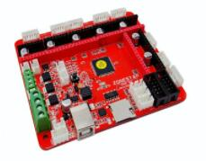
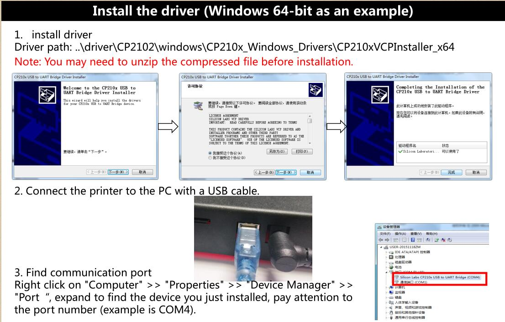

## [ZMIB 3d printer control board](./ZMIB/)

## [ZRIB 3d printer control board](./ZRIB/)

-----
### How to install driver of CP2012 (for ZMIB/ZRIBV4/ZRIBV5/ZRIBV5)
#### [Driver download link](https://www.silabs.com/developers/usb-to-uart-bridge-vcp-drivers)

-----
### [Source code (for reference)](https://github.com/ZONESTAR3D/source-code-for-3d-printer)